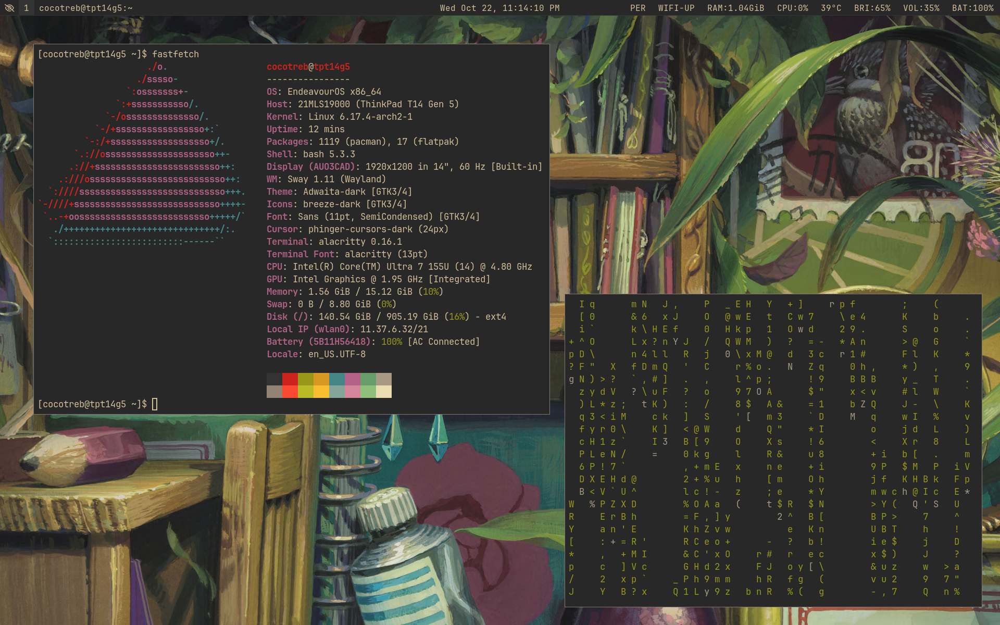
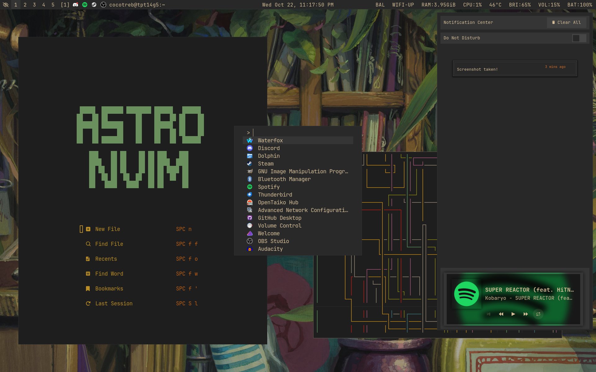

# Personal Dotfiles

These are the dotfiles for my daily driver! I use EndeavourOS alongside SwayWM, but these should work on any distro.

## Dependencies:
- sway
- fuzzel
- alacritty
- waybar
- neovim
- wlogout
- swaylock
- swaync
### Optionals:
- btop
- htop
- cava
- Discord and Vencord

## Gallery:

Feel free to use these for inspiration or as a template for your own dotfiles.
